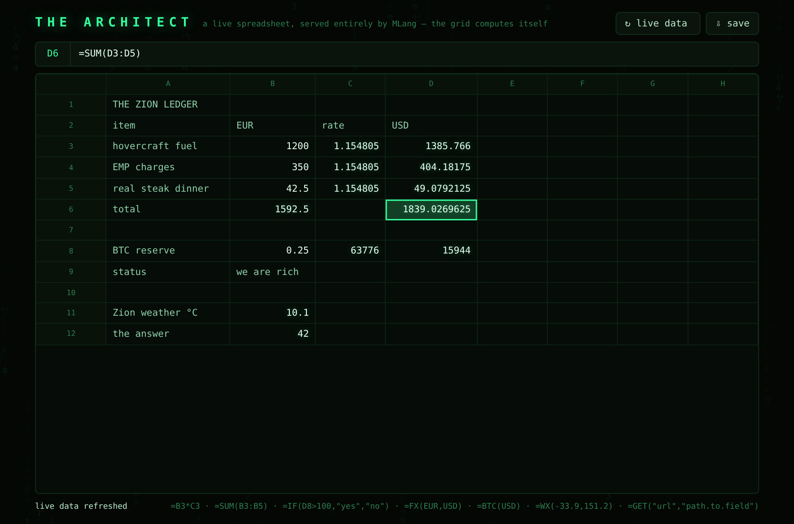

# MLang — the Matrix Language

**Programs are grids. Columns are threads. Every operation is one glyph.**

MLang is a language designed as a **substrate for LLM agents**, not for
human authors: deterministic runs (identical input ⇒ identical output,
interleaving included), faults that arrive as values with exact grid
coordinates, deadlocks that are *proven and reported* instead of hanging,
strands that share nothing — so a patch to one machine cannot break its
neighbors — and a recorded byte-exact conformance corpus that doubles as
an evaluator. No human needs to read it. That's fine.

## This language cannot hang



**An agent iterating on concurrent code needs the failure, not a hung
process. MLang proves its deadlocks.** One stage of this three-machine
pipeline glitches mid-stream ([`examples/deadlock.ml`](examples/deadlock.ml)
— its twin, [`docs/deadlock.py`](docs/deadlock.py), is the Python you'd
naturally write with threads and queues):

```
9⍸[1+∂×]∵⇈α                ※ machine 1: pour the squares of 1..9 into α
[∂25=[«boom»↯][]?2×]⇉αβ    ※ machine 2: double each value α→β — dies at 25
[↧β∂∅≠][⍞]⟳⌫               ※ machine 3: print each value as it arrives
```

```
$ mlang run examples/deadlock.ml
2
8
18
32
✗ glitch in strand 1 (row 2) at 2:13: boom
  2│ [∂25=[«boom»↯][]?2×]⇉αβ
                 ↑ 2:13
  stack: 25
✗ deadlock — every remaining strand is blocked:
  strand 2 (row 3) waiting on channel β at 3:2
  3│ [↧β∂∅≠][⍞]⟳⌫
      ↑ 3:2
```

The glitch quotes the offending line, points a caret at the exact glyph,
and shows the stack as the fault left it — `stack: 25` is the poison
value itself; the scheduler then proves that every remaining strand is
blocked and reports who waits on which channel, with the same excerpt
treatment — and exits nonzero, instantly. The
Python twin prints a traceback from the dead worker thread (interleaved
nondeterministically with the output) and then sits frozen until you kill
it. This output is pinned by the conformance suite — the demo above cannot
silently rot.

## The numbers: machines repairing machine code

The conformance corpus doubles as a benchmark generator: every case has a
recorded golden (stdout, stderr, exit — byte for byte), so a mechanically
seeded bug is born labeled, and a fix is verified against the identical
failure because the runtime is deterministic. The [self-repair
benchmark](bench/) flips one token per program copy, shows an LLM the
broken program + expected output + the failure as the runtime announced
it, and lets it patch and re-run for up to 3 rounds — same protocol on
natural Python translations, where the model gets a stack trace instead
of a wait graph.

| Self-repair — claude-haiku-4-5-20251001, ≤3 rounds | MLang | Python |
|---|---|---|
| seeded one-edit bugs | 80 | 80 |
| **healed (byte-exact output)** | **99%** | **100%** |
| healed in one round | 89% | 100% |
| median rounds to green | 1 | 1 |

| healed, by what the bug turned into | MLang | Python |
|---|---|---|
| caught before running | 7/8 | 54/54 |
| runtime fault, precise report | 36/36 | 23/23 |
| proven deadlock | 3/3 | — |
| silent wrong output | 33/33 | 2/2 |
| hang | — | 3/3 |

A small current model repairs one-edit bugs in a language it has ***never
seen in training*** at essentially the same rate as Python (99% vs 100%),
from an op-reference primer plus the runtime's failure report alone —
every glitch, every proven deadlock, and every silent wrong-output
mutant healed; the one miss is a single weave-error mutant. The honest
reading is that this experiment bounds the floor, not the ceiling: the
corpus programs are small, and the interesting difference is *what kind
of failure* each language hands the model (see the next table). Scale
it up or swap in any model with one flag — `bench/README.md` has the
protocol and every caveat.

A mutant counts as healed only when stdout, stderr, and exit code match
the golden byte for byte. The same mutation engine, with no LLM, measures
what a one-token bug *becomes* in each language — including the bucket
that should scare you, the silent one:

| One-token mutation becomes | MLang | Python |
|---|---|---|
| caught before running (load error) | 13.2% | 73.1% |
| caught at runtime, precise report | 50.4% | 18.7% |
| deadlock — proven and reported | 2.9% | 0.0% |
| **silent wrong output** | 28.5% | 6.0% |
| hang (killed at timeout) | 0.7% | 1.6% |
| no behavior change (equivalent mutant) | 4.3% | 0.6% |

1134 MLang mutants over 120 programs; 828 Python mutants over 29 ports. Same four operator classes per arm (swap / drop / transpose / rename), one edit per mutant, strings and comments masked. 9 of 13 Python hangs printed a thread traceback first — the process still never exited.

The trade is visible and it cuts both ways. Python's redundant syntax
stops 7 in 10 one-edit bugs at the parser; MLang's dense syntax lets 82%
of mutants run. Of the mutants that do run, MLang faults loudly on 65%
against Python's 71% — and fails silently on 35% against Python's 23% —
so density genuinely costs silent failures, and the table says so. What
density buys back is the *quality* of the loud failures: coordinates and
proven wait graphs instead of a traceback or a frozen process — every
blocked-channel bug above is a printed deadlock proof in MLang and a
kill-it-yourself hang in Python, and in the small-program self-repair
benchmark all of MLang's deadlock mutants healed in one round from the
wait graph alone. Numbers, protocol, and the unflattering buckets all
live in [`bench/`](bench/README.md).

### At application scale: the Oracle

Small programs bound the floor. The stress test is
[`examples/oracle.ml`](examples/oracle.ml) — **the Oracle**, a concurrent
MapReduce analytics engine you can question: a reader deals document
lines onto a channel, three mappers form a work-stealing pool and stream
words to a counter, the counter folds them and then *becomes* the
state-owning actor serving queries, each query is parsed on a freshly
spawned strand inside `⍥` (a malformed command reports `✗ …` and dies
alone), and a printer serializes answers — seven strands, five channels,
a two-phase fan-out/fan-in protocol with per-mapper end-of-stream
sign-offs. Its scripted session is conformance-pinned, and
[`bench/python_ports/oracle.py`](bench/python_ports/oracle.py) is the
same architecture in natural Python (threads + queues, a per-command
worker thread with try/except). Seed one-token bugs into *those* and the
languages stop looking alike:

| One-token mutation becomes (Oracle only) | MLang | Python |
|---|---|---|
| caught before running (load error) | 10.7% | 77.8% |
| caught at runtime, precise report | 49.4% | 6.0% |
| deadlock — proven and reported | 14.4% | 0.0% |
| **silent wrong output** | 16.0% | 4.7% |
| **hang (killed at timeout)** | **0.0%** | **10.7%** |
| no behavior change (equivalent mutant) | 9.5% | 0.9% |

243 MLang mutants vs 234 Python mutants of the same application. In the
concurrent Python program, a one-token bug **hangs the process one time
in nine** — 23 of those 25 hangs printed a thread traceback first and
then froze anyway, which is the worst possible input for an agent: a
partial diagnosis attached to a process that never exits. The same class
of bug in MLang becomes a *proven deadlock report* one time in seven,
naming every blocked strand, the channel it waits on, and its grid
coordinates — and nothing hangs, ever. Then the same repair protocol
runs on both — same model, same rounds, same byte-exact bar:

| Self-repair on the Oracle, ≤3 rounds, byte-exact | healed | in one round |
|---|---|---|
| Python — claude-haiku-4-5 | 40/40 (100%) | 100% |
| MLang — claude-haiku-4-5 | 33/40 (82%) | 55% |
| **MLang — claude-opus-5** | **40/40 (100%)** | **98%** |

**With a small model Python wins; with a frontier model MLang draws
level — 40/40, and 39 of those in a single round.** Same forty
deterministic mutants, same toolchain, same ≤3 rounds; only the model
differs. Every class went perfect: 6/6 proven deadlocks, 22/22
glitches, 10/10 silent wrong-output. So the application-scale gap was
**a model-capability gap, not a missing-information gap** — MLang's
runtime was already handing over enough to fix the bug; the small model
just couldn't always use it. haiku's losses concentrate exactly where
you would expect from a language it has never read: semantic bugs in a
dense notation, where Python's redundancy instead converts 35 of its 40
mutants into familiar one-round syntax errors.

**How much of that is noise?** Two runs of the *identical*
configuration disagree on 6 of 40 individual mutants and land 2 apart
in aggregate — a **≈5-point noise floor** at this sample size, from
model sampling alone. So the opus-vs-haiku gap (7 mutants) is real, and
any claim smaller than about 3 mutants is not. That cuts against a
claim this README made earlier: a round of diagnostic improvements
(source excerpts and carets, a channel census naming orphaned channels,
a call chain through `≔` definitions, capped stack dumps — SPEC §4.6)
was measured at 65% → 82%, which is larger than the noise floor and
probably real, but a *second* round of diagnostics aimed at the
remaining failures produced no measurable aggregate change at all
(82% → 78% → 82% across replicates). What that second round did do,
reproducibly across both replicates, is fix the specific failures it
was designed for: proven deadlocks went 5/6 → 6/6 and weave errors
1/2 → 2/2, and all four mutants diagnosed in advance — a four-round
bracket-chase, a renamed channel, a report flooded by one huge stack
value, and a fault inside a definition with no caller link — flipped to
healed. Diagnostics fix the failures you can name; they do not move an
aggregate on their own.

Run any of it with any model:
`bench/heal.py --cases example:oracle.ml,oracle --model <id>`.

## The killer application

The killer app was always the spreadsheet — VisiCalc is the program the
term was coined for. MLang's motto was always *programs are grids*. So
MLang's killer app is both at once:



**THE ARCHITECT** ([`examples/architect.ml`](examples/architect.ml)) is
a live spreadsheet in your browser — and the entire application is one
MLang file. The formula engine (tokenizer → shunting-yard → evaluator),
the multi-pass recalculation that proves circular references instead of
hanging, the HTTP routing, the JSON API, and the dark-glass frontend it
serves are all MLang, running as six strands:

```
0    acceptor    ⎆ pulls each HTTP request and deals it onto κ
1    the engine  owns the sheet: parses, recalculates, routes, answers on β
2    responder   ⍅ writes every response back to the browser
3-5  fetchers    a work-stealing pool: ↧φ url → ⍆ fetch → ⒥ parse → ↥ρ
```

```sh
./mlang serve examples/architect.ml 4321     # → http://127.0.0.1:4321
./mlang serve examples/architect.ml 4321 my.tsv        # open a real TSV
./mlang build examples/architect.ml -o architect       # or weld it:
MLANG_PORT=4321 ./architect                  # one binary, serving
```

Click a cell and type. `=B3*C3`, `=SUM(B3:B5)`, `=IF(D8>100,"yes","no")`
— and then the part a 1979 spreadsheet could not do:
**`=FX(EUR,USD)`** puts a live exchange rate in a cell, **`=BTC(USD)`**
the live bitcoin price, **`=WX(-33.9,151.2)`** the temperature in
Sydney, and **`=GET("url","path.to.field")`** any field of any JSON API
on the internet. Press ↻ and the engine fans the sheet's URLs out to
the fetcher pool over channels (run `serve --parallel` and the fetches
truly overlap), folds the answers back into the cache, and
recalculates; every response is parsed by the Operator — the JSON
library written in MLang itself (`mlang json`).

The language's promises hold at every layer. A formula error is a
glitch caught per cell — `=1/0` shows `✗ ÷ by zero` in that one cell
and nothing else. A circular reference is found by the recalculation
fixpoint and marked `⚠` — the sheet cannot hang. A request that breaks
mid-flight becomes a `500` and a status-bar `✗`, because the engine
wraps each request in `⍥` — the server itself cannot die. A fetch
either delivers or glitches within its 10-second deadline. Shutdown is
a cascade of `∅` poison pills — nothing is ever left blocked, as the
deadlock prover would loudly report. And the whole scripted session —
requests in, page and JSON out — is pinned byte-for-byte in the
conformance corpus, because `⎆`/`⍅` replay framed requests from stdin
exactly the way `⌥` replays keystrokes (SPEC §5.2): the app is a
deterministic function of its request stream.

The sheet saves as honest TSV, so it pastes straight into Excel.

## Programs are grids

You *write* MLang flat: **one line is one strand** — an independent
machine — and all strands run concurrently. This is a complete
three-machine pipeline in 25 glyphs:

```
9⍸[1+∂×]∵⇈α
[2×]⇉αβ
⇟β[⍞]∀
```

Strand 0 pours the squares of 1–9 into channel `α`; strand 1 pumps each
value from `α`, doubles it, and sends it on to `β`; strand 2 drains `β` and
prints. The three machines are synchronized only by their channels; the
end-of-stream protocol (`∅`) is built into the `⇈ ⇉ ⇟` combinators.
Adding machines means adding lines — the program scales like feeding more
tape readers, and no strand's meaning ever depends on its neighbors.

The same program can be *viewed* as digital rain (`mlang rain` renders it;
the engine runs both forms identically — they are transposes):

```
⇓
9  [  ⇟
⍸  2  β
[  ×  [
1  ]  ⍞
+  ⇉  ]
∂  α  ∀
×  β
]
∵
⇈
α
```

Code falling in columns, like the green cascade of the Matrix — or a rack
of punched-tape readers, one tape per machine.

## Try it

MLang is its own language with its own toolchain: one native binary,
`mlang`, is the compiler, runner, and runtime. (The toolchain is
implemented in Rust — the way C's first compilers were implemented in
assembly — but MLang programs never touch Rust, and nothing else is
involved: no C compiler, no linker, no interpreter dependency.)

Build the toolchain once (from the repo root, any platform):

```sh
cargo build --release --manifest-path compiler/Cargo.toml
```

Then use the bundled launcher — `./mlang` on Linux/macOS, `.\mlang.cmd` in
PowerShell — no alias or PATH setup needed. Linux / macOS:

```sh
./mlang build examples/mandelbrot.ml -o mandelbrot   # compile → native binary
./mandelbrot                                         # standalone: no toolchain needed

./mlang run examples/editor.ml         # or compile-and-run in one step
./mlang run --parallel examples/mandelbrot.ml   # strands on OS threads
./mlang hub examples/net-primes-hub.ml          # …or machines on TCP
./mlang worker --connect host:7777 examples/net-primes-worker.ml
./mlang serve examples/architect.ml 4321  # serve a web app (⎆/⍅) live
./mlang eval '«Hello, Matrix»⍞'      # inline source
./mlang check examples/calc.ml       # compile only, report weave errors
./mlang rain examples/pipeline.ml    # render the vertical rain view
./mlang ops                          # the sigil reference
./mlang std                          # the standard library source
./mlang ui                           # the Construct — the UI library source
./mlang json                         # the Operator — the JSON library source
```

Windows (PowerShell) — same commands via `.\mlang.cmd`, and name compiled
output `.exe`:

```powershell
.\mlang.cmd build examples\mandelbrot.ml -o mandelbrot.exe
.\mandelbrot.exe
.\mlang.cmd run examples\editor.ml
```

Windows notes: WSL is *not* required — the toolchain, the welded
binaries, and the `cargo test` suite are fully native on Windows (the
recorded file-I/O goldens use relative paths, and `⌨` strips `\r\n` line
endings). Use Windows Terminal (not legacy conhost) with a
Unicode-capable font so the glyphs render.

`mlang build` compiles source to MLang bytecode and welds it into a copy
of the toolchain's own runtime image — the same shape as a Go binary,
where the runtime is linked into every executable. The result is a
self-contained native executable: it starts in milliseconds, embeds the
standard library, and can never hit a runtime-version mismatch, because
it carries the exact runtime it was built with.

The language's observable behavior is pinned by a recorded conformance
corpus — 156 cases covering every operation, concurrency, glitches, both
source forms, and all example programs, compared byte-for-byte on stdout,
stderr, and exit code (`cargo test` runs it; the goldens in
`conformance/expected.json` are the spec's ground truth, and any future
second implementation must reproduce them exactly).

## One pipeline, N machines (experimental)

Strands share nothing but channels and a stream ends with an in-band
`∅` — so a channel can cross a machine boundary without changing the
language. `mlang hub` runs a program with its work channel bridged over
TCP to any number of joined `mlang worker` machines and its results
channel fed by them; the worker program is literally the pump stage you
would write in a single-process pipeline, one line:

```
[∂0@⇒a 1@⇒b b a-⍸[a+]∵[p]⌿⇒r⟨r# r#0=[0][r⌷]?⟩]⇉αβ
```

Work is dealt demand-driven (a fast machine ends up with more of it),
workers may join mid-run, and the failure model is the language's own,
over a socket: a worker that glitches or dies mid-chunk has its
unanswered items requeued on the survivors —

```
⇅ worker 1 lost — 2 items requeued
⇅ worker 2 finished
π(<100000) = 9592
largest: 99991
```

— and because the example reduces order-independently, that output is
byte-identical for any worker count and any network timing. The
deterministic engine and the conformance corpus are untouched;
[`docs/distributed.md`](docs/distributed.md) has the protocol, the
guarantees kept, and the ones knowingly traded.

## The idea

| What an agent needs | MLang's answer |
|---|---|
| **Failures it can act on** | Any fault is a **glitch** carrying a value and exact grid coordinates. `⍥` catches glitches with the stack restored to a known depth. An uncaught glitch kills only its own strand — the rest of the grid keeps running (Erlang-style isolation) and the run exits nonzero with a precise report. If every remaining strand is blocked, the scheduler *proves* the deadlock and reports who waits on what, instead of hanging. |
| **Reproducible runs** | Strands are scheduled round-robin with a fixed slice: identical input ⇒ identical run, including output interleaving. A failure reproduces exactly, so a fix is verified against the identical failure. Deterministic concurrency is what makes machine-written concurrent code debuggable by a machine. |
| **Patches that can't break neighbors** | Strands share *nothing*. They communicate only over named channels — raw `↥α` send / `↧α` receive, or the stream combinators `⇈` pour, `⇉` pump, `⇟` drain, which carry the end-of-stream protocol for you. Adding, removing, or reordering strands never changes the meaning of another strand — the channel names are the entire interface. |
| **Memory safety by construction** | Every value is immutable. There are no pointers, no references, no shared mutable state. Data races are impossible *by construction*, not by discipline. Indexing is bounds-checked; arithmetic on wrong types is a caught fault, never corruption. |
| **A built-in evaluator** | The recorded conformance corpus pins every observable behavior byte for byte — and doubles as a benchmark generator: seed a bug in any corpus program and the correct output is already known ([`bench/`](bench/README.md)). |
| **Linear writing, parallel structure** | One flat line = one strand = one machine. Because LLMs emit text linearly, flat form is the authoring form; the vertical rain grid is the same program transposed (a `mlang rain` view), so the punch-tape geometry costs nothing at writing time. Programs compile to standalone native binaries (`mlang build`). |

## Thirty seconds of MLang

MLang is concatenative (Forth/Joy lineage) with APL-style glyphs. Values go
on a stack; every glyph transforms the stack. `[...]` quotes code as a
value, which is how control flow works.

```
3 4+⍞                              ※ 7 — postfix: push 3, push 4, add, print
0 1[∂1000<][∂⍞⇅⊚+]⟳⌫⌫              ※ Fibonacci below 1000
10⍸[1+∂×]∵⍞                        ※ squares of 1..10 → ⟨1 4 9 … 100⟩
101⍸ 0[+]⍀⍞                        ※ 5050 — fold ⟨0..100⟩ with +
[∂×]≔² 12²⍞                        ※ define ² as square, call it: 144
[1 0÷][«caught: »⇅⍕⧺⍞]⍥            ※ caught: ÷ by zero
[42↥r]⚡⋈↧r⍞                        ※ spawn a strand, join it, read its answer
100⍸⇈α                             ※ pour ⟨0..99⟩ into channel α, then ∅
[∂×]⇉αβ                            ※ pump: square each value from α into β
⇟β 0[+]⍀⍞                          ※ drain β to a list, fold with + : 328350
«https://open.er-api.com/v6/latest/EUR»⍆⒥⟨«rates» «USD»⟩⒫⍞
⋮                                  ※ fetch a JSON API, parse it, dig a field
```

Numbers write negatives as `¯5` (¯ binds to the literal; `-` is always
binary subtraction). Strings are `«…»` with `⏎` for newline. Lists are
`⟨1 2 3⟩`. `∅` is nil — conventionally the end-of-stream sentinel on
channels.

A **standard library** — written in MLang itself (`mlang std` prints it) —
is woven into every program before its boot section: constants (`π τ ℯ ∞`),
numerics (`∣` abs, `⊓` min, `⊔` max, `‼` factorial, `⟌` gcd), aggregates
(`∑` sum, `∏` product, `µ` mean), list tools (`⊃` head, `⌷` last, `⍫`
tail, `⊤`/`⊥` take/drop, `⍒` sort-desc, `⍚` zip), and text tools (`⇑`/`⇩`
case, `⍭` words, `⍖` lines), built on five engine primitives: `⍙` type-of,
`⌽` reverse, `⍋` sort, `∈` contains, `⍷` find. `examples/std-tour.ml`
walks through all of it:

```
⟨31 4 15 9 2 6⟩⍋⍞         ※ ⟨2 4 6 9 15 31⟩
«the matrix has you»⍭⌽« »⊇⍞  ※ you has matrix the
462 1071⟌⍞                ※ 21
⟨«red» «blue»⟩⟨«pill» «shift»⟩⍚⍞  ※ ⟨⟨«red» «pill»⟩ ⟨«blue» «shift»⟩⟩
```

In **flat form** each line is a strand — write this. In **rain form**
(first line `⇓`) each *column* is a strand — view this. `mlang rain` and
`mlang flat` transpose between them; both run identically. A `⇊` divider
marks a **boot section** that runs to completion before the strands start
— the place for shared `≔` definitions.

Scaling is literal geometry: four workers and a reducer are five columns.
Each worker reads its own strand id `⍳`, picks its chunk, and sends a
partial sum down `σ`; the reducer adds them (`examples/parallel-sum.ml`,
prints 500500). At runtime, `⚡` spawns new strands to scale beyond the
grid's static width.

The showpiece is `examples/mandelbrot.ml`: an interactive Mandelbrot
explorer. Four worker strands shard the 24 rows by strand id and render
each frame in parallel; a navigator strand owns the viewport, streams
render jobs to the workers over channels, reassembles their rows in
order, and reads commands from stdin — `a d w s` pan, `z x` zoom (the
escape-time depth rises as you dive), `r` reset, `q` quit — a full
interactive event loop in 5 strands and two boot definitions. Run it
with `mlang run --parallel` and the four workers land on four cores:
same bytes on screen, ~3.4× faster frames.

Its sibling `examples/mandelbrot-dive.ml` is **THE DIVE** — the same
grid on autopilot, in full Matrix dress. No keys: each frame the
navigator scores a 4×4 grid of cells by boundary richness and zooms 2×
toward the most interesting one, so the camera hugs the writhing edge
and never wastes a frame on blank sky or solid interior; every dive
resets and flies a different line, and `⌂` argv sets how many
(`mlang run --parallel examples/mandelbrot-dive.ml 6`). The painting
shows the parallelism itself: workers drop finished rows —
`⟨y colored plain⟩` — into one shared channel and the navigator paints
each row at its absolute screen position (green-on-black ANSI shading)
the moment it lands. Under `--parallel` the arrival order is four real
threads racing; the finished image is identical every time.

`examples/calc.ml` is an RPN calculator on the live platform — the
Construct's widgets driven by `⏵`. Two strand-locals hold the entire
machine: `s`, the value stack, and `e`, the digits being typed. Every
button carries the slot that edits them, and the tree is redrawn after
each one. Press `8` or click `[ 8 ]` — both land in the entry, because
a click resolves to whatever drew the `(key)` under the pointer. An
operator commits the pending entry before it folds the top two values,
so `12 p 4 +` and `12 p 4 p +` are the same 16. A slot that glitches —
`÷` by zero, an operator with one operand — becomes a `✗` status line
and the calculator keeps running.

```
┌─ Calculator ──────────────────────────────────────┐
│ Stack                                             │
│ • 16                                              │
│ • 8                                               │
│ ───────────────────────────────────────────────── │
│ Entry: —                                          │
│ ───────────────────────────────────────────────── │
│ [ 7 ](7)  ⟦ 8 ⟧(8)  [ 9 ](9)  [ ÷ ](/)            │
│ [ 4 ](4)  [ 5 ](5)  [ 6 ](6)  [ × ](*)            │
│ [ 1 ](1)  [ 2 ](2)  [ 3 ](3)  [ − ](-)            │
│ [ 0 ](0)  [ . ](.)  [ ^ ](^)  [ + ](+)            │
│ ───────────────────────────────────────────────── │
│ [ Push ](p)  [ Drop ](d)  [ Swap ](w)  [ Mod ](%) │
│ [ Clear ](c)  [ Quit ](q)                         │
└───────────────────────────────────────────────────┘
```

The same arithmetic without the widgets is `examples/rpn.ml`, a
fault-tolerant concurrent RPN calculator that evaluates every input line
on a freshly spawned strand: a bad line reports `✗ …` and dies alone,
`⋈` keeps the answers in input order, and the calculator keeps
answering. And `examples/editor.ml` is **MatrixPad** — a real, full-screen text
editor. The document fills the terminal, you type to insert, the cursor
keys move you around: `↑ ↓ ← → Home End PgUp PgDn` — or a mouse click, which places the
cursor where you point — Enter/Backspace/Delete edit, `^S` saves (asking for a name if there is none), `^O`
opens, `^Z`/`^Y` undo and redo, `^F` finds (wrapping around), and `^X`
exits — warning once if there are unsaved changes. The screen looks
like an editor because it is one:

```
 MatrixPad — neo.txt ×
The Matrix has you.
Wake up, Neo.█
Follow the white rabbit.

 ^S save  ^O open  ^Z undo  ^Y redo  ^F find  ^X exit · Ln 2 Col 14
```

Under the hood it is the same three-strand event loop — keyboard (`⌥`
raw input events), editor core, and screen (ANSI frames) joined by channels —
and the whole editor rests on the language's guarantees: the document
is an immutable list of lines, every edit a slice-and-concat, so
undo/redo is literally a list of old `⟨buffer cursor⟩` snapshots;
dispatch runs inside `⍥`, so a glitch becomes a status-bar message and
the document survives by construction. Because `⌥` decodes piped bytes
exactly like live keys, the *same recorded keystrokes always produce
the same screens* — the conformance corpus drives this editor with a
scripted session and pins every frame it draws. Weld it
(`mlang build examples/editor.ml -o matrixpad.exe`) and dropping a
.txt onto the executable opens that file (`⌂`), on any platform —
the runtime enables ANSI processing even in a legacy Windows console.

MatrixPad has a big sibling — and it does not live in the terminal.
`examples/sublime.ml` is **SUBLIMINAL**, a Sublime Text clone that
opens as a real desktop window, drawn pixel by pixel in MLang. Five
ops are the whole graphics story: `⌸` opens a 960×600 canvas, `▦`
fills rectangles, `⌶` draws text from a font baked into the runtime,
`⎙` presents the frame, and `⌹` lists a directory — and out of them
the program builds the Mariana-colored chrome: a **FOLDERS sidebar**
of the working directory where clicking a file opens it (or jumps to
its tab if it's already open), **tabs** with `●` unsaved dots and `✕`
close buttons, a syntax-highlighted code pane — comments, strings,
numbers, brackets, and every MLang sigil in its own color, live as
you type — a **real minimap**, every line's words in miniature with
the viewport shaded and click-to-jump, and a status bar. The Sublime
signature moves are all in: **multiple cursors** — `^D` selects the
word under the cursor, `^D` again adds its next occurrence (wrapping,
skipping what's already selected), and typing replaces every
selection at once; the **command palette** — `^P`, fuzzy-matched
(`dup` finds *duplicate line*), with Goto Anything folded in (`:42`
jumps to line 42, `#boom` finds boom); line numbers, current-line
highlight, auto-indent, auto-closing `[ ⟨ «` pairs that type-over,
and line cut/copy/paste/join/sort/comment.

```
mlang run examples/sublime.ml [file …]        # opens a window
mlang build examples/sublime.ml -o subl       # weld a standalone editor
```

A multi-cursor selection is one integer (`row×2²⁰+column`), so the
flat `⍋` sorts a selection set and an edit replays across it with
per-line offsets — no new machinery, just lists and slices.

The window is the interesting part. The canvas has two backends that
draw identical pixels (SPEC §5.2): on a desktop it is an OS window
whose keyboard and mouse feed `⌥`; piped, the frame stays in memory
and every `⎙` prints the frame's hash instead, so the conformance
corpus drives a full scripted tour — typing, a multi-cursor replace,
the palette, find, a second tab, clicks on the tab bar, sidebar,
minimap, and text — and pins every pixel of all 59 frames, byte for
byte, in CI with no display anywhere. Set `MLANG_FRAMES=dir` and the
same run dumps each frame as an image; that is how the screenshots
were made. Text is deterministic because the glyphs are, too: an
8×16-pixel grayscale strip (`compiler/src/font.bin`) baked from
DejaVu Sans Mono, covering ASCII, every sigil in the repo's sources,
and the box-drawing set.

## The Construct — the UI library

> "This is the Construct. It's our loading program. We can load anything…"

MLang has a widget toolkit in the lineage of Qt/PySide, written in MLang
itself: **the Construct** (`std/ui.ml`, printed by `mlang ui`). The Qt
cast is all here, one glyph each — `Ⓛ` QLabel, `Ⓑ` QPushButton, `Ⓔ`
QLineEdit, `Ⓒ` QCheckBox, `Ⓟ` QProgressBar, `Ⓘ` QListWidget, `Ⓥ`/`Ⓗ`
box layouts, `Ⓦ` QMainWindow — plus `⌺` draw, `▶` `app.exec()`, `⏵`
the live event loop, `◼` `quit()`, and `✎` the status bar. And there
is no import statement: reference a Construct sigil and the loom
weaves the library into your program's boot strand (SPEC §6.1).
Libraries load like weapons racks in the Construct — you name them,
they appear.

Widgets are immutable values, so a PySide program's shape inverts, and
Qt's signals-and-slots become the good kind of simple: a **slot** is a
quotation carried by the widget, and the event loop runs it when the
widget's key arrives on stdin (`key`, or `key argument` for a line
edit). State lives in your strand's locals; the view quotation rebuilds
the widget tree from them every frame, so a stray slot can corrupt
nothing — the worst it can do is glitch, which `▶` catches and shows as
a `✗` status message while the app keeps running. A whole application
is a view and a handful of slots:

```
0⇒c [⟨«count: »c⍕⧺Ⓛ «+1»«+»[c1+⇒c]Ⓑ «Quit»«q»[◼]Ⓑ⟩Ⓥ«Counter»Ⓦ]▶
```

```
┌─ Counter ───┐
│ count: 0    │
│ [ +1 ](+)   │
│ [ Quit ](q) │
└─────────────┘
```

And it is genuinely interactive — keyboard and mouse. The engine op
`⌥` reads one input event: keys arrive as the glyph they are («↑»
«↵» «⌫», Ctrl-C is «␃»), a mouse press as `⟨«⌖» x y⟩`. `⏵` is `▶`
gone live: Tab and the arrow keys move focus (the focused widget wears
`⟦brackets⟧`), typing lands in the focused line edit behind a `▏`
caret, `↵` or space activates, a click lands on whatever drew the
`(key)` under the pointer, and Ctrl-C jacks out. On a real terminal
the runtime flips to raw input with mouse reporting on the alternate
screen and restores everything on exit; piped, the same bytes replay
the same session — which is exactly how the conformance corpus pins
it. Views and slots don't change at all: `examples/jack-in.ml` is the
operator console below with one glyph changed, `▶` → `⏵`.

The showcase is `examples/construct.ml`, the Nebuchadnezzar's operator
console — line edit, buttons, checkbox, progress bar, item list, status
bar, all live (`printf '+⏎n Trinity⏎j⏎r⏎q⏎' | mlang run
examples/construct.ml`, or weld it into a standalone binary like any
other program):

```
┌─ Nebuchadnezzar — operator console ──────────┐
│ Wake up, Neo…                                │
│ ──────────────────────────────────────────── │
│ Operator: Neo▁▁▁▁▁▁▁▁▁ (n)                   │
│ [ Jack in ](j)  [ ] Red pill (r)             │
│ ──────────────────────────────────────────── │
│ Signal strength                              │
│ ▓▓▓▓▓▓░░░░░░░░░░░░░░ 30%  [ + ](+)  [ − ](-) │
│ ──────────────────────────────────────────── │
│ Crew aboard                                  │
│ • Morpheus                                   │
│ • Trinity                                    │
│                                              │
│ [ Exit ](q)                                  │
└──────────────────────────────────────────────┘
```

## Repository

```
compiler/         the MLang toolchain (one binary: compiler + runner + runtime)
  src/lex.rs      glyph stream → instructions
  src/forms.rs    rain/flat grid parsing and rendering
  src/vm.rs       compile, strands, channels, glitches, deterministic scheduler
  src/par.rs      the opt-in parallel scheduler: strands on OS threads
  src/net.rs      mlang hub / mlang worker — channels bridged over TCP
  src/wire.rs     the line-per-value wire codec net.rs speaks
  src/payload.rs  bytecode serialization + native binary welding (mlang build)
  tests/          cargo test: unit, payload round-trip, standalone-binary
                  execution, parallel + distributed runs, and the full
                  conformance corpus
std/std.ml        the standard library — written in MLang
std/ui.ml         the Construct — the UI library, also written in MLang
conformance/      cases.json + expected.json: 156 recorded goldens, the
                  language's observable ground truth (RECORD=1 to re-record)
bench/            the self-repair benchmark — the conformance corpus doubles
                  as a labeled bug generator (see bench/README.md)
docs/             the deadlock demo (animated SVG + the Python twin) and
                  distributed.md — the hub/worker design and its trade-offs
examples/         runnable programs (mandelbrot, calc, editor, oracle, …)
SPEC.md           the full language specification
```

## Honest notes

* **Glyphs vs. tokens.** MLang optimizes *characters* — the number of
  atoms a model must emit correctly — not today's BPE token counts, and
  on those it currently loses: rare Unicode glyphs cost 2–3 BPE tokens
  each. Measured with `bench/tokens.py`:

  | program | chars | o200k tokens | cl100k tokens |
  |---|---|---|---|
  | `fizzbuzz.ml` | 115 | 78 | 79 |
  | `fizzbuzz.py` (natural port) | 183 | 63 | 63 |
  | `pipeline.ml` | 369 | 140 | 143 |
  | `pump_pipeline.py` (natural port) | 567 | 145 | 145 |

  A dedicated tokenizer would make one-glyph-one-op literally one token
  per operation (the mapping is trivial by design), but no deployed model
  has one. The density argument that *does* hold today is correctness
  density: there is no syntax to misindent and no identifier to misspell
  twice — see the mutation-robustness table above for what that buys,
  and what it costs.
* **Determinism first, parallelism on demand.** By default the runtime
  interleaves strands deterministically (round-robin, fixed slice):
  identical input ⇒ identical bytes out, which is what makes
  machine-written concurrent code debuggable by a machine, and is what
  the conformance corpus pins. Because the language model (immutable
  values, channel-only communication) admits true parallelism without
  data races, the toolchain also ships it: `mlang run --parallel` (or
  `MLANG_PAR=1` for welded binaries) puts every strand on its own OS
  thread. Per-strand order, FIFO channels, glitch isolation, and
  deadlock detection carry over; only cross-strand interleaving becomes
  timing-dependent — and programs wired as single-producer
  single-consumer pipelines with one printing strand (the Mandelbrot
  explorer, `pipeline.ml`) produce byte-identical output either way,
  just faster: the four-worker Mandelbrot renders ~3.4× quicker on four
  cores.
* **The benchmark's limits.** The small-program corpus is small by
  design, and the Python control arm is 29 hand-verified ports, not all
  120 programs. Models have seen enormous amounts of Python and
  essentially zero MLang — the MLang arm leans entirely on an
  op-reference primer in the prompt. With a small model that costs real
  points at application scale (82% vs Python's 100% on the Oracle); with
  a frontier model it costs nothing measurable (100%, 39 of 40 in one
  round). Read the small-model number as the floor and the frontier
  number as the ceiling, and note that both sit above a ≈5-point
  run-to-run noise floor that any single-run comparison here has to
  clear. `bench/README.md` spells out the protocol and every caveat.

## Name

**M**atrix **Lang**uage. The rain falls in columns. The columns compute.
