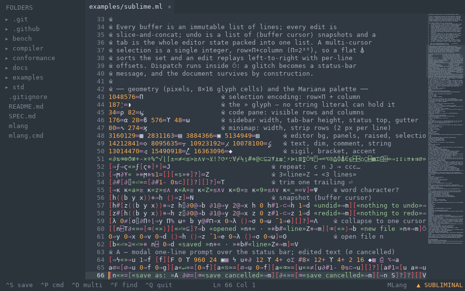
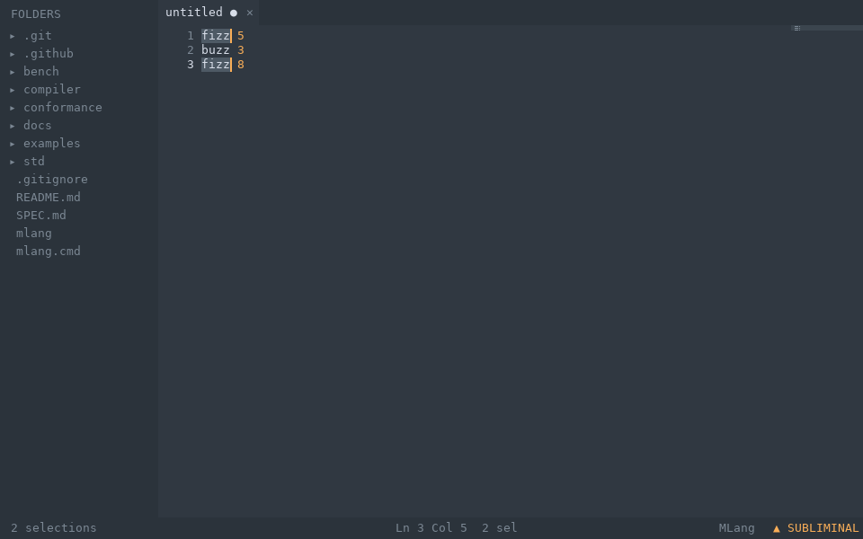
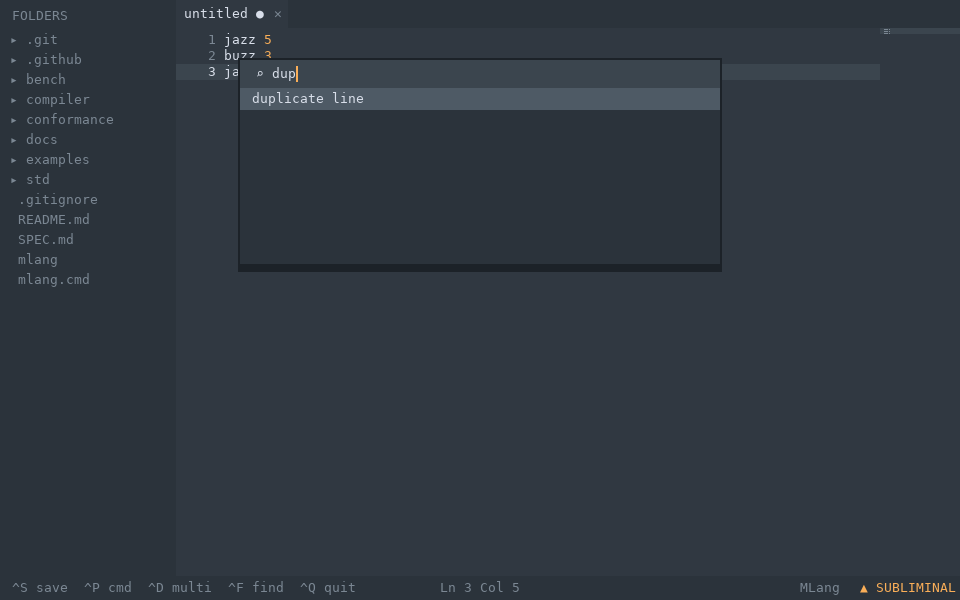
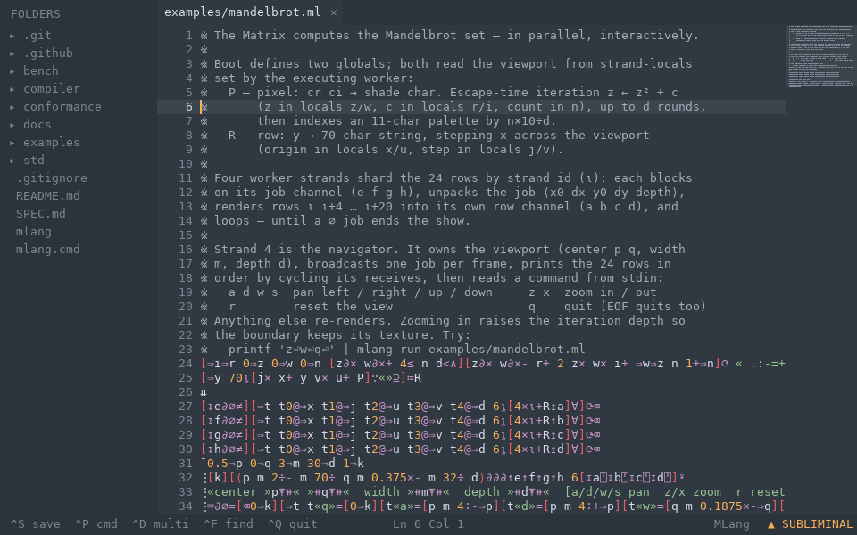
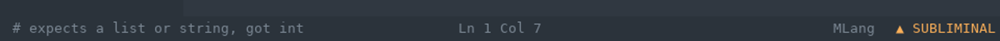

# SUBLIMINAL

**A Sublime Text clone that opens as a real desktop window — written
entirely in MLang, a language whose every operation is one glyph.**



That screenshot is SUBLIMINAL editing its own source code — the entire
editor you are looking at: the folder sidebar, the tabs, the
syntax-highlighted pane, the minimap on the right, the status bar, the
caret. One file, [`examples/sublime.ml`](../examples/sublime.ml),
237 lines. Everything on screen is drawn by that file, rectangle by
rectangle, glyph by glyph.

## Run it

You need [Rust](https://rustup.rs) once, to build the MLang toolchain:

```
git clone https://github.com/monkzoren/MLang && cd MLang
cargo build --release --manifest-path compiler/Cargo.toml
```

Then, on Windows:

```
.\mlang.cmd run examples\sublime.ml
```

macOS / Linux (X11):

```
./mlang run examples/sublime.ml
```

A 960×600 window opens. Files named on the command line open as tabs
(`.\mlang.cmd run examples\sublime.ml README.md SPEC.md`). Or weld a
standalone editor that needs no toolchain at all —

```
.\mlang.cmd build examples\sublime.ml -o subl.exe
```

— and drop a file onto `subl.exe` to open it. The font ships inside
the binary.

## What it does

| | |
|---|---|
|  |  |

* **FOLDERS sidebar** — the working directory, listed by the language's
  `⌹` op. Click a file to open it; if it's already open, you jump to
  its tab.
* **Multiple cursors** — `^D` selects the word under the cursor, `^D`
  again adds its next occurrence (wrapping, skipping what's selected).
  Typing replaces every selection at once; `⎋` collapses to one.
* **Command palette** — `^P`, fuzzy-matched: `dup` finds *duplicate
  line*. Goto Anything is folded in: `:42` jumps to line 42, `#boom`
  finds boom.
* **Tabs** — `●` marks unsaved, `✕` closes, click to switch. `^N` new,
  `^E` next, `^W` close, `^O` opens a path into a new tab.
* **A real minimap** — every line's words in miniature, viewport
  shaded, click to jump anywhere in the file.
* **Live syntax highlighting** for MLang source in the Mariana palette:
  comments, strings, numbers, brackets, and every operator glyph in
  its own color.
* Line numbers, current-line highlight, auto-indent on `↵`,
  auto-closing `[ ⟨ «` pairs (typing the closer types over it), `⇥`
  indents two spaces.
* **Line surgery** — `^X` cut, `^C` copy, `^V` paste, `^K` delete,
  `^J` join, `^_` toggle `※` comment; sort, reverse, case, and trim
  live in the palette.
* `^S` save (prompts for a name), `^F` find (wraps), `^G` goto line,
  `^Z` undo, `^Y` redo, `^Q` quit — warns once if anything anywhere
  is unsaved.



## How is this 237 lines?

57 of them are comments, so 180 lines of code — but lines are the
wrong unit for MLang. Every operation is a single Unicode glyph: `∂`
is dup, `⍋` is sort, `▦` fills a rectangle. Those 180 lines carry
**~6,600 glyphs ≈ 6,600 tokens**, roughly the token mass of a
thousand-line Python program. The information is real; the encoding is
just close to the entropy floor. (For calibration: `kilo`, the famous
minimal terminal editor, is ~1,000 lines of C — with no window, tabs,
multi-cursor, palette, minimap, or sidebar.)

The other honest number: the graphics support added to the Rust
runtime for this editor is ~480 lines, and it deliberately knows
nothing about editors. The language grew exactly five primitives:

| op | does |
|---|---|
| `⌸` | open a pixel canvas (an OS window — or headless, see below) |
| `▦` | fill a rectangle |
| `⌶` | draw text from an 8×16 font baked into the runtime |
| `⎙` | present the frame |
| `⌹` | list a directory |

There is no widget toolkit, no layout engine, no text-shaping library
underneath. Tab widths, click hit-testing, scroll clamping, what turns
green after a `«` — all of it is computed in the MLang file. Input
arrives through the language's ordinary `⌥` event op: the window's
keys and mouse produce the same event values a terminal would, so the
editor's dispatch doesn't know which one it's running against.

Inside the file, the machinery is the language's own idioms:

* the document is an **immutable list of lines**; every edit is
  slice-and-concat, so undo is literally a list of old
  `⟨buffer cursor⟩` snapshots;
* a multi-cursor selection is **one integer**, `row×2²⁰+column`, so
  the flat sort op `⍋` orders a selection set and an edit replays
  across it left-to-right with per-line offsets;
* a tab is the whole editor state packed into one list slot;
* every keystroke dispatches inside `⍥` (try/catch), so a glitch
  becomes a status-bar message and the document survives by
  construction.

## Every pixel is pinned

MLang is deterministic: same program, same input, same bytes out.
The canvas keeps that promise. Run SUBLIMINAL with stdin piped
instead of a terminal and the same program renders headless — each
presented frame prints a hash of its pixels:

```
$ ./mlang run examples/sublime.ml < tour-keystrokes
⌸ 960×600 «SUBLIMINAL»
⎙ 1 #c8eb3c2fc387d855
⎙ 2 #b3990efc309869a8
…
```

The conformance corpus replays a scripted 64-frame tour — typing, a
multi-cursor replace, palette commands, find, a second tab, clicks on
the tab bar, sidebar, minimap and text, the save prompt, the
unsaved-quit warning — and pins all 64 hashes, byte for byte, in CI
with no display anywhere. Set `MLANG_FRAMES=dir` and the same run
dumps every frame as an image; each screenshot on this page was made
exactly that way.

The corpus is also an error detector for the whole editor. Flip a
single glyph in `sublime.ml` — change the row pitch `16` to `15`, or
one `@` (index) into `#` (length) — and the program still weaves and
still runs, but 39 of the 64 recorded frame hashes change, so the
suite fails on the spot. The second of those mutants is worth seeing.
Pressing `↵` trips the planted fault, and the editor shrugs:



`# expects a list or string, got int` — the fault arrives as a value,
the dispatch's `⍥` turns it into a status-bar message, and the
document is untouched, because no edit that glitches mid-way can
corrupt an immutable buffer. That resilience isn't editor code; it's
the language. (The repo's [bench/](../bench/README.md) measures this
systematically: what one-token bugs become in MLang vs Python, and
how well an LLM repairs each.)

## Keyboard & mouse reference

| keys | |
|---|---|
| `↑ ↓ ← → ⇱ ⇲ ⇞ ⇟` | move (Home/End/PgUp/PgDn) |
| `^D` / `⎋` | add multi-cursor selection / collapse |
| `^P` | command palette (`:n` goto, `#text` find) |
| `^F` `^G` | find (wraps) · goto line |
| `^S` `^O` | save · open path |
| `^Z` `^Y` | undo · redo |
| `^N` `^E` `^W` | tab: new · next · close |
| `^X` `^C` `^V` | cut · copy · paste line |
| `^K` `^J` `^_` | delete line · join · toggle `※` comment |
| `⇥` / `↵` | indent two spaces / newline with auto-indent |
| `^Q` | quit (warns once about unsaved tabs) |

| mouse | |
|---|---|
| click text | place the cursor |
| click a tab / its `✕` | switch / close |
| click a file in the sidebar | open it (or jump to its tab) |
| click the minimap | jump the viewport |

## Current limitations

Honest list, in the order users hit them:

* Sidebar folders don't expand yet — files only, one level.
* The window is fixed at 960×600: no resize, no fullscreen.
* The minimap is click-to-jump, not drag-to-scroll — the language's
  `⌥` op currently delivers mouse presses, not drags.
* No shift-selections or clipboard beyond whole-line cut/copy/paste.
* One font, one size (the deterministic baked strip).

## Troubleshooting

* **No window appears, hashes print instead** — the canvas goes
  headless when stdin is not an interactive terminal or
  `MLANG_HEADLESS=1` is set. Run it directly from a real shell.
* **Linux** — the windowed backend uses X11 (works under XWayland).
  Headless mode needs nothing at all.
* **A build without graphics** — `cargo build --release
  --no-default-features` skips the window backend entirely; the
  editor still runs headless and the conformance suite still passes.

The canvas is specified in [SPEC §5.2](../SPEC.md); the ops table is
`mlang ops`; the editor is one file: [`examples/sublime.ml`](../examples/sublime.ml).
